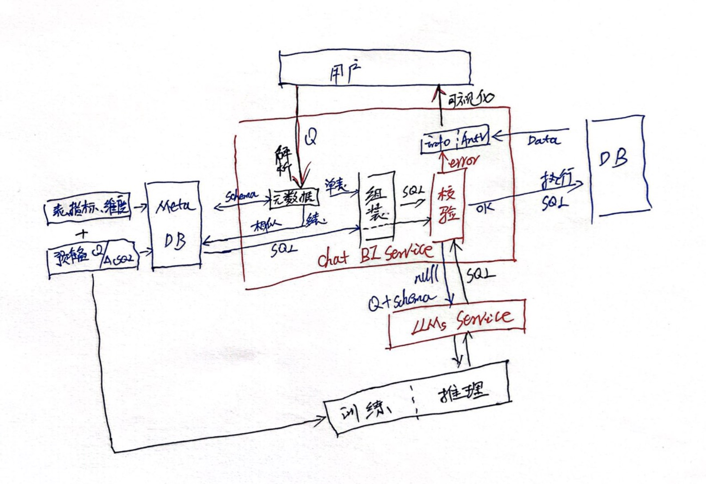

    自定义BI改变了传统IT主导开发固定报表的时代，让数据能够即席分析达到所见即所得，随着大模型的兴起与火热，LLMs 结合数据可视化技术，
通过问答的方式能够让系统智能与数据交互与生成图表，无论是BI copilot还是ChatBI, 除了替代之前小助手功能只能查询已有报表数据外，
更多的是省略创建dashboard拖拉拽的操作，让新生成的图表和已经存在或者创新新的dashboard。

一、实现思路主要考虑
1、如果没有大模型或者大模型服务宕机，自动化生成可视化工程化就不能实现？
        —— 直接解耦，大模型不能影响主体工程，图表这块不能大模型生成
2、如果大模型正常服务能够推理，是否所有的问答都要经过推理服务？
        —— 大模型的推理是否那么靠谱稳定、对应响应的耗时
3、以SQL交互为核心的配套组件，通过系统化的工程来达到生产可用要求。
      借鉴[SQLChat](https://github.com/sqlchat/sqlchat), [DB-GPT](https://github.com/csunny/DB-GPT), 的开源项目思路，确定以SQL生成为核心，和数据库交互获取数据，通过data + 可视化图表组件方式实现。不考虑大模型自动生成图表的方式，主要考虑一是美观，二是灵活性，三最主要的是性能是否可控，尤其是大量查询的data很大时，是否分页等可以手动人为干预控制；而靠大模型自动生成图表类似markdown/html估计不会很理性。

二、主要思路框架
   

四、说明
1、是否 ${input_dim_conditions} <= ${user_has_permission}，否直接报权限不足；
2、如果维度、度量，都来自于一张表，解析查询条件，然后sql模版组装：
select ${input_dim_names} , ${input_metric_names} from ${get_meta_table_name} where ${input_dim_conditions}  [group by $s] [order by $s];
3、 如果维度、度量都来自于多张表，则查找相似匹配的问题对应的答案Sql:
      ①、如果有对应sql, 则直接应用，可能只组装的就是sql的where条件；
      ②、如果有相似sql, 例如2张表的join找2张表join的sql模版则对应需要增加子查询方式与拼接where,  即

select ${input_dim_names} , ${input_metric_names} from ( ${get_query_sql} ) TT where ${input_dim_conditions}  [group by $s] [order by $s];
复制
       这里where一般可以，sql引擎都支持谓词下推，但是子查询多列可能带来性能影响，不是所有的sql引擎都支持列剪裁。 同时注意相似如果是2张表join,则不能找3张表join的sql语句去拼接。
       ③、如果sql为null或者校验error, 则交给大模型推理返回推理生成sql。
整体框架可能存在不足，但是相信随着时间的进步，大模型会越来越稳定可靠，响应快 以及细分领域SQL LLMs的诞生；也相信利他主义的开源者，会诞生更优秀的ChatBI项目。

|--rest  api层
   |-- server  服务层，调用解析，校验，执行sql，和数据库交互
   |-- mapper  元数据匹配
   |--validate  sql校验
|--common
|--parse   文本解析
|--plugins 大模型插件，和大模型交互，智能生成
